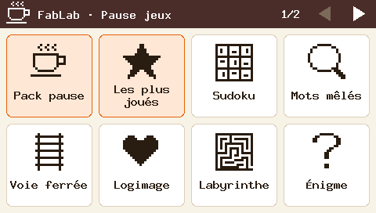

# Printr · borne FabLab

Des jeux imprimés à la demande sur une imprimante à tickets **Epson TM-T88V**, pour la borne
installée à côté de la machine à café du FabLab : sudoku, mots mêlés, voie ferrée, logimage,
énigmes… On choisit son jeu sur un écran tactile, le ticket sort en quelques secondes.

<p align="center">
  
</p>

Ce dépôt est un fork de [Printr](https://github.com/XNinety9/Printr), de X99, recentré sur la
borne : **tout fonctionne hors ligne**, sans compte ni service extérieur. Les nouveaux jeux sont
proposés au projet d'origine (voir [Contribuer](#contribuer)). Ce qui reste à faire est dans
[`TODO.md`](TODO.md).

| Dossier | Contenu |
| --- | --- |
| [`kiosk/`](kiosk/) | La borne : description des jeux (`games.json`), modèles de tickets, interface tactile et simulateur |
| [`src/`](src/) | Printr : les blocs (un fichier par jeu dans `src/blocks/`), la mise en page, l'impression ESC/POS |
| [`examples/`](examples/), [`docs/exemples/`](docs/exemples/) | Tickets d'exemple, et un exemple par bloc avec son rendu |
| [`emulator/`](emulator/) | Profil de l'imprimante pour l'émulateur emupos |
| [`scripts/`](scripts/) | Rendu dans l'émulateur, relais d'impression pour Windows |

## Démarrage rapide

```sh
cargo run -p borne-sim                                              # visite de la borne, écrans en PNG dans kiosk/captures/
cargo run -p borne-sim -- tap:299,97 tap:364,238 | cargo run -- --preview print   # imprime un sudoku… dans le terminal
scripts/demo.sh examples/voie-ferree.json                           # rendu exact d'un ticket dans l'émulateur
cargo run -- --device /dev/usb/lp0 print examples/matin.json        # sur la vraie imprimante
```

## La borne

L'interface est pensée pour un écran tactile de 480 × 272 (carte ESP32-S3 de 4,3″ visée) :

- **Accueil** : une grille de jeux, huit par page. Les packs, en tuiles orangées, impriment
  plusieurs jeux à la fois.
- **Jeu** : une description, les réglages (niveau, thème…) et le bouton « Imprimer ». Les jeux
  qui le permettent ont aussi un bouton « Solution », en bas à gauche : on tape le numéro
  imprimé sur la grille, et la borne en imprime la solution.
- **Impression**, puis « Bonne pause ! », et retour à l'accueil. Sans appui pendant une minute,
  la borne revient d'elle-même à l'accueil.

L'interface ne connaît pas les jeux : tout est décrit dans [`kiosk/games.json`](kiosk/games.json),
et chaque ticket est mis en forme par un modèle de [`kiosk/templates/`](kiosk/templates/).
Ajouter un jeu, changer un réglage par défaut ou la présentation d'un ticket ne demande donc
qu'une modification de ces fichiers.

### Décrire un jeu

```json
{
  "id": "sudoku",
  "title": "Sudoku",
  "icon": "sudoku",
  "description": "Une grille à solution unique.",
  "block": { "type": "sudoku", "difficulty": "moyen" },
  "options": [
    { "label": "Niveau", "key": "difficulty", "choices": [
      { "label": "Facile", "value": "facile" },
      { "label": "Moyen", "value": "moyen" },
      { "label": "Difficile", "value": "difficile" }
    ] }
  ],
  "solution": { "key": "seed" }
}
```

| Champ | Rôle |
| --- | --- |
| `id` | Identifiant, pour désigner le jeu dans un pack |
| `title`, `description` | Titre de la tuile, phrase sous l'icône |
| `icon` | Une icône intégrée (`sudoku`, `loupe`, `rails`, `labyrinthe`, `coeur`, `question`, `calcul`, `lettre`, `crayon`, `enveloppe`, `fleur`, `haltere`, `etoile`, `cafe`), ou un dessin en lignes de `#` et de `.` (32 × 32 au plus) |
| `block` | Le bloc de ticket imprimé, avec ses paramètres par défaut (voir [les blocs](#les-blocs)) |
| `options` | Réglages proposés à l'écran. Chaque choix donne la valeur du paramètre `key` ; `null` le retire (Printr choisit alors au hasard). Sans `key`, chaque valeur est un objet fusionné dans le bloc, par exemple `{ "width": 8, "height": 10 }` pour un petit labyrinthe. Jusqu'à quatre choix côte à côte, au-delà avec des flèches |
| `solution` | Bouton « Solution » : `key` reçoit le numéro tapé (`seed` pour les grilles générées, `number` pour les logimages), `max` est le plus grand numéro accepté, `set` ce qui est ajouté au bloc (`{"solution": true}` par défaut). La solution reprend les réglages choisis à l'écran, qui doivent être ceux du ticket |
| `template` | Modèle de ticket propre au jeu (sinon celui de `"template"`, en tête de `games.json`) |

### Packs

Une entrée avec `pack` à la place de `block` imprime plusieurs jeux sur un même ticket, chacun avec
ses réglages par défaut :

```json
{
  "title": "Pack pause",
  "icon": "cafe",
  "description": "Quatre jeux tirés au hasard, pour toute la pause.",
  "pack": { "pick": "hasard", "count": 4, "exclude": ["petit-bac", "coloriage", "logimage"] },
  "template": "pack"
}
```

| `pick` | Jeux du pack |
| --- | --- |
| `tous` (défaut) | Tous ceux de `games`, dans l'ordre |
| `hasard` | `count` jeux (5 par défaut) tirés au hasard, différents à chaque ticket |
| `populaires` | Les `count` jeux les plus imprimés sur la borne (à égalité, l'ordre de `games.json`) |

`games` limite le choix à une liste d'`id`, sinon tous les jeux de la borne sont candidats ;
`exclude` en écarte certains. La borne compte les impressions de chaque jeu : l'appareil sauvegarde
ce décompte (`App::popularity`) et le reprend au démarrage (`App::set_popularity`).

### Modèles de tickets

Un modèle est un ticket au format habituel, où le bloc `{ "type": "jeu" }` marque la place du
jeu choisi. Par exemple [`kiosk/templates/defaut.json`](kiosk/templates/defaut.json) :

```json
{
  "cut": true,
  "spacing": 1,
  "blocks": [
    { "type": "title", "text": "FabLab" },
    { "type": "date" },
    { "type": "jeu" },
    { "type": "separator", "style": "─" },
    { "type": "text", "text": "Bonne pause !", "small": true, "align": "center" }
  ]
}
```

- Le nom d'un modèle est celui de son fichier ; chacun contient un et un seul bloc `jeu`.
- Pour un pack, le bloc `jeu` reçoit tous ses jeux à la suite, séparés par les blocs de `entre` :
  `{ "type": "jeu", "entre": [{ "type": "separator", "style": "═" }] }`.

Une impression sur 100 000 (0,001 %) est précédée d'un [glitch](#autres-blocs), seul sur son
propre ticket, coupé (`App::set_glitch_odds` pour changer la fréquence, `0` pour jamais).

`cargo test` vérifie que chaque ticket que la borne peut produire (chaque jeu, chaque réglage,
chaque pack, chaque solution) est valide et s'imprime sans erreur.

### Simulateur

`kiosk/sim` joue une suite d'appuis sur l'interface, enregistre chaque écran en PNG et écrit les
tickets produits (un fichier et une ligne par ticket). Sans étapes, il fait la visite guidée.

```sh
cargo run -p borne-sim -- tap:299,97 tap:410,84 tap:364,238      # sudoku, difficile, imprimer
cargo run -p borne-sim -- --seed 7 --glitch 0 --gif docs/borne.gif  # l'animation ci-dessus
```

| Étape ou option | Effet |
| --- | --- |
| `tap:X,Y` | Appui, en points |
| `wait:MS` | Temps qui passe |
| `fail` | La prochaine impression échoue |
| `--kiosk <dossier>` | Dossier de `games.json` et `templates/` (défaut `kiosk`) |
| `--out <dossier>` | Dossier des captures et des tickets (défaut `kiosk/captures`) |
| `--seed <n>` | Rejoue le même tirage des packs |
| `--glitch <n>` | Un ticket glitch une impression sur `n` (`1` : toujours, `0` : jamais) |
| `--gif <fichier>` | Enregistre aussi la visite en GIF animé, appuis marqués d'un cercle |

Repères à l'écran : les tuiles sont centrées en x = 63, 181, 299, 417 et y = 97, 211 ; « Imprimer »
en 364,238 ; « Solution » en 68,238 ; « Retour » en 55,18 ; page suivante en 458,18.

L'interface elle-même est la crate `kiosk/ui` (`borne-ui`), dessinée avec
[embedded-graphics](https://docs.rs/embedded-graphics) et indépendante du matériel : l'appareil
lui transmet les appuis et le temps qui passe, l'affiche, et imprime les tickets qu'elle demande.

## Printr, le moteur des tickets

### Utilisation

```sh
printr print examples/matin.json    # ticket composé de blocs
cat ticket.json | printr print      # idem, depuis l'entrée standard
printr --preview print ticket.json  # aperçu dans le terminal, sans imprimer
printr -q print ticket.json         # silencieux, n'affiche que les erreurs
printr test                         # ticket de test (styles, accents, QR code)
printr text "Salut !"               # texte libre, puis coupe
printr image logo.png               # image réduite à 512 px, tramée (Floyd–Steinberg)
printr image --no-dither logo.png   # simple seuil noir/blanc, pour logos et dessins au trait
```

| Destination | |
| --- | --- |
| `--device <chemin>` | Imprimante USB (défaut `/dev/usb/lp0`, ou `$PRINTR_DEVICE`) |
| `--tcp hôte:port` | Imprimante réseau, émulateur ou relais Windows |
| `--dump <fichier>` | Octets ESC/POS bruts dans un fichier |

### Tickets JSON

Un ticket est une liste de blocs, imprimés dans l'ordre. Un bloc en échec imprime un message au
lieu de bloquer le ticket ; un paramètre inconnu est une erreur, pour repérer les fautes de frappe.

```json
{
  "cut": true,
  "spacing": 1,
  "blocks": [
    { "type": "title", "text": "Pause café" },
    { "type": "enigme" },
    { "type": "voie_ferree", "difficulty": "moyen" }
  ]
}
```

### Les blocs

**Jeux**

| Bloc | Paramètres (défaut) | Notes |
| --- | --- | --- |
| `sudoku` | `difficulty` (`facile`/`moyen`/`difficile`), `seed`, `solution` | Grille à solution unique |
| `word_search` (ou `mots_meles`, `mots_caches`, `mots_en_grille`) | `difficulty`, `theme`, `words`, `seed`, `solution` | Mots mêlés en français. `theme` : `animaux`, `fruits_legumes`, `cuisine`, `nature`, `sport`, `metiers`, `maison`, `voyage`, `musique`, `ecole`, `developpement`, `devops`, `reseaux`, `ia` (tiré du n° si absent) ; ou ses propres mots dans `words`. De 10×10 (vers la droite et le bas) à 14×14 (dans tous les sens) |
| `train_tracks` (ou `voie_ferree`, `rails`) | `difficulty`, `seed`, `solution` | Relier A (bord gauche) à B (bord bas) par une seule voie, d'après le nombre de cases de voie de chaque ligne et colonne. Grilles de 6×6, 8×8 et 10×10, à solution unique |
| `nonogram` (ou `logimage`) | `number` (1 à 10), `solution` | Logimage de 10×10, à solution unique, trouvable par déduction |
| `maze` | `width` (12), `height` (16), `seed` | Entrée en haut, sortie en bas |
| `riddle` (ou `enigme`) | `kind` (`devinette`/`charade`/`logique`/`calcul`), `number`, `answer` (`envers`/`lendemain`/`dessous`/`aucune`) | 125 énigmes, une par jour sans répétition ; réponse imprimée à l'envers par défaut |
| `anagram` (ou `mot_mystere`) | `theme` (comme `word_search`), `count` (3), `seed` | Lettres mélangées, réponses à l'envers |
| `petit_bac` | `players` (1), `letter`, `count` (6), `categories`, `seed` | Une lettre et des catégories, une feuille par joueur |
| `cipher` (ou `message_code`) | `message`, `cipher` (`cesar`/`morse`/`nombres`), `shift`, `answer` (true) | Message codé et sa grille de déchiffrement |
| `coloring` (ou `coloriage`) | `seed` | Mandala à colorier |
| `mental_math` (ou `calcul_mental`) | `difficulty`, `count` (10), `seed` | Fiche d'opérations, résultats à l'envers (pas sur la borne) |

**Numéro de grille et solution.** Les grilles générées portent un numéro en bas à droite : c'est
leur graine. Pour imprimer la solution, on reprend ce numéro dans `seed`, avec la même difficulté
(et le même thème ou les mêmes mots pour les mots mêlés), et on ajoute `"solution": true` :

```json
{ "type": "voie_ferree", "difficulty": "moyen", "seed": 4521, "solution": true }
```

#### Autres blocs

| Bloc | Paramètres (défaut) | Notes |
| --- | --- | --- |
| `title` | `text`, `size` (2) | Gras, centré, agrandi |
| `text` | `text`, `bold`, `underline`, `reverse`, `small`, `size` (1), `align` (`left`/`center`/`right`) | Coupé aux mots |
| `separator` | `style` (`-`) | Un caractère répété : `-`, `=`, `═`, `─`, `·`… |
| `date` | — | « Mercredi 7 octobre 2026 » |
| `feed` | `lines` (1) | Espace vertical |
| `image` | `path`, `dither` (true) | Fichier local réduit à 512 px (logo du FabLab…) |
| `qr` | `data`, `size` (6), `caption` | |
| `picto` | `shape` (`coeur`/`etoile`/`soleil`/`fleur`/`sourire`), `size` (`petit`/`moyen`/`grand`), `count` (1) | Petit dessin |
| `saint` | — | Calendrier local |
| `quote` | — | Citation du jour, liste locale |
| `holidays` | `zone` (`metropole`/`alsace-moselle`), `count` (1) | Prochains jours fériés, calcul local |
| `countdown` | `label`, `date` (`AAAA-MM-JJ`) | « J-79 avant : Noël » |
| `moon` | — | Phase, illumination, prochaines pleine et nouvelle lunes |
| `todo` | `items`, `title` (« À faire ») | Cases à cocher |
| `wifi` | `ssid`, `password`, `security` (`wpa`/`wep`/`none`), `hidden`, `show_password` (true) | QR code qui connecte au réseau |
| `bins` (ou `poubelles`) | `collections` (`name`, `days`, `every`, `from`), `when` (`veille`/`jour`), `always` | Rappel des jours de ramassage |
| `barnum` | `sign` ou `birth_date` (`AAAA-MM-JJ`), `sky` (false), `variant` | Horoscope hors ligne calculé par [Barnum](https://github.com/XNinety9/Barnum), à installer à part : `barnum` dans le PATH, ou la commande donnée dans `PRINTR_BARNUM` |
| `glitch` | — | Un message étrange, comme du bruit imprimé |

En plus du ticket glitch de la borne, Printr glisse lui-même un glitch au milieu d'une impression
sur 20. `PRINTR_GLITCH` règle cette fréquence (`PRINTR_GLITCH=5` pour une sur cinq, `0` pour
jamais).

### Exemples

- [`examples/`](examples/) : `matin.json` (pause café), `complet.json` (tous les blocs),
  `extras.json`, et un ticket par jeu (`sudoku.json`, `mots-meles.json`, `voie-ferree.json`).
- [`docs/exemples/`](docs/exemples/) : un exemple par bloc avec son rendu PNG, régénéré par
  `docs/exemples/generer.sh [bloc…]`.

## Tester sans imprimante (émulateur)

[emupos](https://pypi.org/project/emupos/) simule l'imprimante et rend chaque ticket en PNG et en
texte. Le dossier `emulator/` contient un profil TM-T88V (512 points, 180 dpi).

```sh
scripts/demo.sh                          # examples/complet.json par défaut
scripts/demo.sh examples/voie-ferree.json
# → affiche le chemin du rendu, emulator/receipts/<id>.png (et .txt)
```

Le script lance l'émulateur, imprime le ticket, attend le rendu puis arrête l'émulateur. À la
main, dans deux terminaux :

```sh
cd emulator && uvx emupos run                # terminal 1
cargo run -- --tcp 127.0.0.1:9100 test       # terminal 2
```

## Développer sous Windows (dev container)

Le dossier `.devcontainer/` fournit un environnement Linux avec Rust et uv : dans VS Code
(extension Dev Containers, Docker Desktop lancé), **Reopen in Container**. Tout se fait ensuite
dans le terminal du conteneur :

```sh
cargo run -- --preview print ticket.json                        # aperçu dans le terminal
scripts/demo.sh ticket.json                                      # rendu PNG via l'émulateur
cargo run -- --tcp host.docker.internal:9101 print ticket.json   # vraie imprimante, via le relais
```

### Relais PowerShell vers l'imprimante USB

L'imprimante USB reste branchée sur Windows. Le script
[`scripts/windows-relay.ps1`](scripts/windows-relay.ps1) écoute sur `127.0.0.1:9101` côté Windows
et transmet chaque connexion reçue à la file d'impression, en brut (RAW, sans le rendu du pilote).
Un ticket = une connexion : il est imprimé à la fermeture de celle-ci.

Dans un terminal PowerShell **Windows**, à la racine du dépôt, et le laisser ouvert :

```powershell
powershell -ExecutionPolicy Bypass -File scripts\windows-relay.ps1
# Relais 127.0.0.1:9101 -> 'EPSON TM-T88V Receipt' (Ctrl+C pour arrêter)
```

Options : `-Printer "nom"` si la file Windows porte un autre nom (liste : `Get-Printer | Select Name`),
`-Port 9102` pour un autre port.

En cas de souci :

- **`impossible de se connecter à host.docker.internal:9101`** : le relais ne tourne pas (ou sur un
  autre port). Vérifier côté Windows avec `Test-NetConnection 127.0.0.1 -Port 9101`.
- **Le script s'arrête au démarrage** : la file `-Printer` n'existe pas ; prendre le nom exact
  donné par `Get-Printer`.
- **Connexion acceptée mais rien ne sort** : vérifier que l'imprimante est allumée et que la file
  Windows n'est pas en pause ou en erreur.

## Raspberry Pi

Compilation avec [`cross`](https://github.com/cross-rs/cross) (nécessite Docker) :

```sh
cross build --release --target aarch64-unknown-linux-gnu    # Pi 3 / Zero 2 W, OS 64 bits
cross build --release --target arm-unknown-linux-gnueabihf  # Pi Zero W (ARMv6)
scp target/aarch64-unknown-linux-gnu/release/printr pi@raspberrypi:
```

L'imprimante USB est exposée par le module noyau `usblp` en `/dev/usb/lp0`. Pour y accéder sans
`sudo` :

```sh
sudo cp deploy/70-tm-t88v.rules /etc/udev/rules.d/
sudo udevadm control --reload && sudo udevadm trigger
sudo usermod -aG lp $USER   # puis se reconnecter
```

La règle crée aussi le lien stable `/dev/tm88` : `printr --device /dev/tm88 test`.

## Contribuer

Les nouveaux jeux sont proposés au projet d'origine, [XNinety9/Printr](https://github.com/XNinety9/Printr),
en suivant son guide [`CONTRIBUTING.md`](https://github.com/XNinety9/Printr/blob/master/CONTRIBUTING.md) :
une branche partant de son `master`, puis une pull request. La structure des blocs (`src/blocks/`,
l'enum `Block`, `draw.rs`, `doc.rs`) est gardée identique à la sienne pour qu'un bloc passe
facilement de l'un à l'autre. Une fois le bloc ajouté ici, il suffit d'une entrée dans
`kiosk/games.json` pour le proposer sur la borne.
